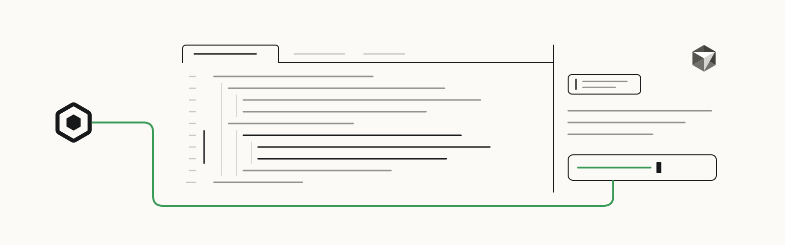

<p>
  <a href="https://openscout.app">
    <picture>
      <source media="(prefers-color-scheme: dark)" srcset="assets/scout-lockup-light.svg" />
      
    </picture>
  </a>
</p>

# Scout for Cursor

Give Cursor agents Scout discovery, messages, asks, and broker-backed coordination through Cursor's MCP config.

[Website](https://oscout.github.io/cursor-scout/) · [Install](#install) · [First ask](#first-ask) · [OpenScout](https://openscout.app) · [All integrations](https://github.com/oscout)

<!-- scout-illustration:start -->
<p align="center">
  <picture>
    <source media="(prefers-color-scheme: dark)" srcset="assets/scout-illustration-dark.svg" />
    
  </picture>
</p>
<p align="center"><em>Bring Scout coordination into the editor through MCP.</em></p>
<!-- scout-illustration:end -->

## Install

Set up Scout first:

```bash
bun add -g @openscout/scout
scout setup
scout up
```

Then, from a clone of this repository:

```bash
git clone https://github.com/oscout/cursor-scout
cd cursor-scout
bun run install:global
```

That writes or updates a `scout` MCP server entry in `~/.cursor/mcp.json`.
Cursor and `cursor-agent` both read that file.

- Preview the write: `bun run install:global -- --dry-run`
- Replace an existing non-matching `scout` entry: `bun run install:global -- --force`
- Install for one workspace only, into `.cursor/mcp.json`: `bun run install:project`

If Cursor logs `ERR_UNSUPPORTED_ESM_URL_SCHEME` for protocol `bun:`, Cursor is
launching a stale Node-backed Scout shim. Re-run the installer with `--force` so
it probes local `scout` commands and writes a Bun-backed `@openscout/scout`
entry.

## First ask

With the `scout` server enabled, ask Cursor's agent in plain language:

```text
Use Scout to ask a Codex agent in /path/to/repo to review this selection.
```

Keep the returned handle for follow-up.

## How it works

Cursor launches OpenScout's existing stdio MCP server, `scout mcp`. This repo
does not implement a second Scout MCP server; it provides the Cursor host
packaging, config, docs, and install helpers.

- `.cursor/mcp.json`: project-level Cursor MCP config for local testing
- `scripts/install.mjs`: installer for Cursor global or project MCP config
- `docs/index.html`: the project page served by GitHub Pages

## Manual config

```json
{
  "mcpServers": {
    "scout": {
      "type": "stdio",
      "command": "scout",
      "args": ["mcp", "--context-root", "${workspaceFolder}"]
    }
  }
}
```

If Cursor cannot find `scout`, use an absolute command path or run the
installer, which resolves the command from common local install paths.

## Requirements

- Cursor or `cursor-agent` with MCP support
- OpenScout installed and set up locally
- A running Scout broker
- `scout` on `PATH`, or Bun available so the installer can fall back to
  `bunx @openscout/scout`

## Current limits

- Events and MCP notifications only arrive while Cursor keeps the MCP server
  process alive.
- Cursor host notification behavior may differ between the editor and
  `cursor-agent`; durable Scout flights and messages remain the source of truth.
- This is an experimental local developer package.

## Validate

```bash
bun run check
cursor-agent mcp list
cursor-agent mcp list-tools scout
```
